<p align="center">
  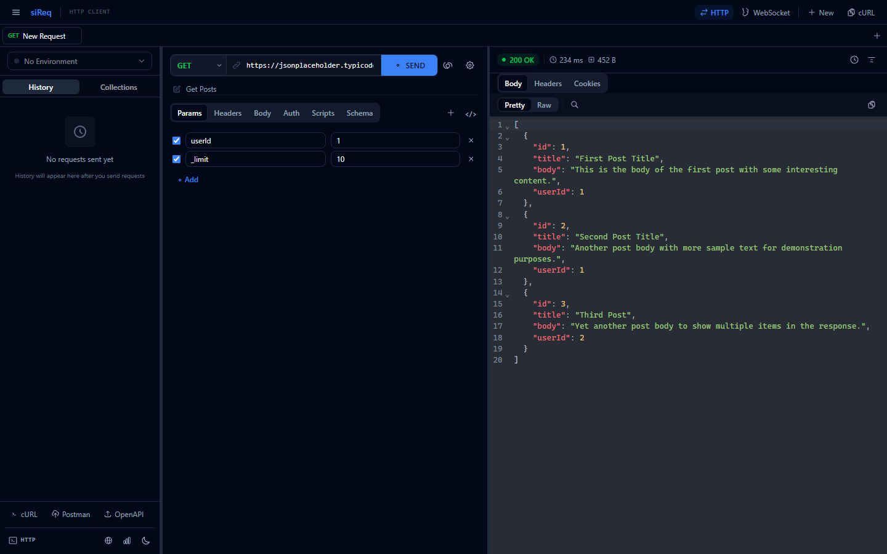
</p>

<div align="center">
  <h1>siReq</h1>
  <h3>A modern, high-performance desktop API client</h3>
  <p>HTTP · GraphQL · gRPC · WebSocket · Scripting · Benchmarking · API Intelligence</p>
</div>

<p align="center">
  
  
  
  
  
  
  
  
  
</p>

---

## Why siReq?

**siReq** is a full-featured, native desktop API client built with **Tauri v2** (Rust) and **React 19** (TypeScript). It brings the power of Postman-like workflows into a lightweight, high-performance desktop application — without the bloat.

- **⚡ Native performance** — Rust-powered backend with no Electron overhead
- **🔧 One tool for everything** — HTTP, gRPC, WebSocket, benchmarking, scripting, mock servers, collections, visual flows, and API analytics
- **🔒 Local-first** — All data stored locally in SQLite with encrypted secrets
- **🤖 Automation-ready** — Variables, JavaScript scripting, data-driven runs, JSONPath variable extraction, and visual chaining flow graphs
- **🎨 Modern UX** — 12 themes, interactive grid canvas, resizable panels, shortcuts, command palette, and tabbed workflows
- **🔄 Interoperable** — Import from cURL, OpenAPI, and Postman; export to Postman format

---

## Table of Contents

- [Features at a Glance](#features-at-a-glance)
- [Screenshots](#screenshots)
- [Installation](#installation)
- [Quick Start](#quick-start)
- [Detailed Features](#detailed-features)
  - [HTTP Requests](#http-requests)
  - [Response Viewer](#response-viewer)
  - [Collections](#collections)
  - [Environments & Variables](#environments--variables)
  - [Scripting & Automation](#scripting--automation)
  - [Import / Export](#import--export)
  - [GraphQL Client](#graphql-client)
  - [gRPC Client](#grpc-client)
  - [WebSocket Client](#websocket-client)
  - [Smart Mock Server](#smart-mock-server)
  - [Visual Chaining Flow Editor](#visual-chaining-flow-editor)
  - [Benchmark Tool](#benchmark-tool)
  - [Collection Runner](#collection-runner)
  - [API Intelligence](#api-intelligence)
  - [UI / UX](#ui--ux)
- [Tech Stack](#tech-stack)
- [Data Persistence & Security](#data-persistence--security)
- [Project Structure](#project-structure)
- [Contributing](#contributing)
- [License](#license)

---

## Features at a Glance

### HTTP & Response Inspection

| Feature | Details |
|---------|---------|
| **Methods** | GET, POST, PUT, PATCH, DELETE, HEAD, OPTIONS, TRACE |
| **Body types** | None, JSON, XML, Text, Form Data (multipart), Form URL-encoded |
| **Auth** | None, Basic, Bearer Token, API Key (header or query param) |
| **Request settings** | Timeout, follow redirects, SSL verification, proxy support |
| **Response viewer** | Pretty-print, raw, preview (images/PDF); syntax highlighting; find-in-page; headers, cookies, diff view, JSON schema viewer |
| **Tabs** | Multi-request tab interface with duplicate and rename |

### Collections & Environments

- Tree-based collection organization with nested folders
- Collection-level auth and variables
- Environment management with scoped variables
- Global variables shared across all requests
- Secret variable encryption (AES-256-GCM)

### Scripting & Automation

- **Pre-request scripts** — Modify requests before sending, set variables, log output
- **Post-response scripts** — Test assertions, extract data, write tests
- **Postman-like API** — Familiar `pm.*` scripting interface
- **Variable extraction** — Extract values from responses via JSONPath
- **Dynamic variables** — `{{$timestamp}}`, `{{$uuid}}`, and custom `{{variable}}` resolution

### Imports & Interoperability

- cURL command import
- OpenAPI / Swagger spec import → collection generation
- Postman collection import and export

### GraphQL, gRPC & WebSocket

- **GraphQL**: Schema Introspection & visual explorer, SDL schema parser, CodeMirror autocomplete/linting editor, JSON variables editor, custom Auth & Headers, HTTP query/mutation sending, and `graphql-ws` WebSocket subscriptions
- **gRPC**: Parse `.proto` files, server reflection, unary/server-streaming/client-streaming/bidirectional streaming calls, TLS support
- **WebSocket**: Connect to `ws://`/`wss://` endpoints, send/receive messages, real-time log, environment variable resolution

### Visual Chaining Flow Editor

- **Interactive Node-Graph** — Drag and drop workspace with dot-grid backdrop, 10px snap alignment, custom drag-to-connect wire handles, and smooth mouse-wheel panning/zooming.
- **Dynamic Bezier Paths** — Fluid cubic Bezier wires linking ports. Supports active **neon traveling pulse animations** along wire routes to show real-time signal flows!
- **State-Driven Engine** — Runs request chains visually, resolving double-brace `{{variables}}` placeholders in URLs, headers, and request bodies before firing.
- **Robust Node Types** — Start triggers, HTTP Request nodes, wait delay timers, JS conditional branching logic nodes, and format-ready Console Loggers.
- **Integrated Debug HUD** — Collapsible monospaced Flow Debugger Terminal, live variables context list, and granular inspectors.

### Smart Mock Server

- **Multi-Server Orchestrator** — Spin up up to 5 local mock servers concurrently on custom TCP ports
- **OpenAPI & Collection Import** — Automatically map OpenAPI v2/v3 spec files or existing HTTP collections into fully-featured mock servers with endpoints, paths, methods, and mock scenarios in seconds
- **Dynamic Scenarios** — Add multiple conditional scenarios per endpoint, configuring custom status codes, headers, and response bodies
- **Request Matching Rules** — Route to specific scenarios based on headers, query parameters, full request body, or complex JSONPath matching
- **Response Templating** — Procedurally generate mock data with inline `{{faker.uuid}}`, `{{faker.name}}`, `{{faker.email}}`, `{{faker.integer(min,max)}}` variables, or dynamically echo request path, queries, headers, and body elements (via JSONPath)
- **CORS & Global Headers** — Configure CORS parameters (origins, methods, credentials, allowed headers) and global response headers per server
- **Real-Time Logs & Statistics** — Inspect live logs in a streaming console, view transaction details, warning banners for broken templates, and live metrics (Req/Err count, avg latency)
- **Latency Profiles** — Simulate real-world network latency using fixed delays, random ranges, or normal distribution profiles


### Benchmarking & Intelligence

- **Benchmark tool**: Run 1–1000 iterations, get min/max/avg/median/P95/P99 stats, distribution chart, status code analysis, result comparison
- **Collection runner**: Sequential collection execution with configurable delay, stop-on-failure, data-driven runs (CSV/JSON)
- **API Intelligence**: Analyze request history, endpoint insights, performance trends, schema evolution, regression detection

### UI, Themes & Productivity

- 12 built-in themes (Dark, Light, Nordic, Sunset, Midnight, Monochrome, Terminal, True Dark, Matrix, Solarized, Nord, System)
- Resizable panels, command palette (<kbd>Ctrl+K</kbd>), keyboard shortcuts dialog (<kbd>?</kbd>)
- Toast notifications, first-class dark mode support

---

## Screenshots

Here are some screenshots of siReq in action across its various features and panels.

### Main Workspace

<p align="center">
  
</p>

### HTTP Request Builder

<p align="center">
  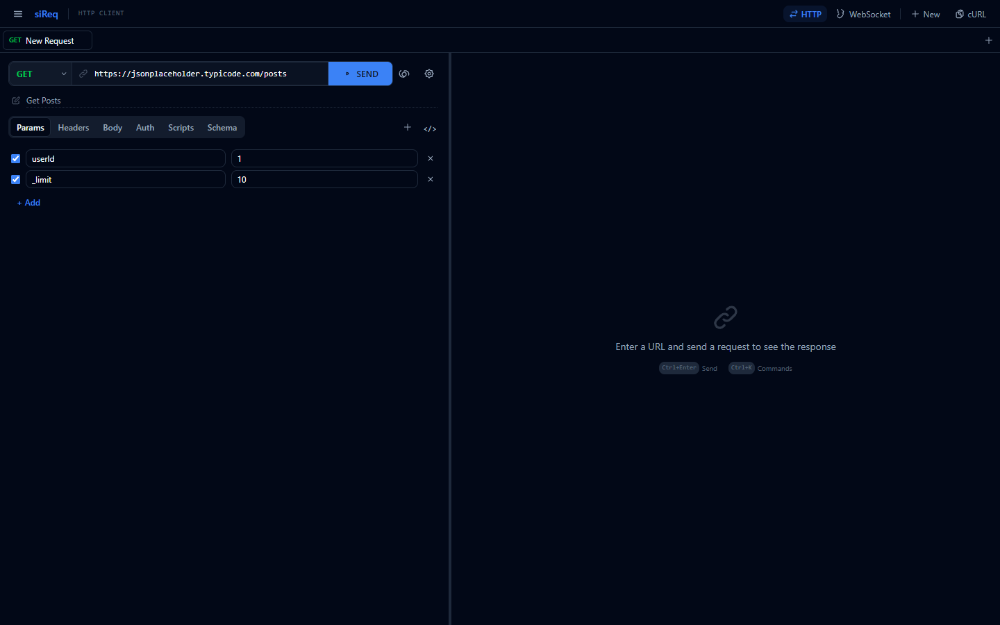
</p>

### Response Viewer

<p align="center">
  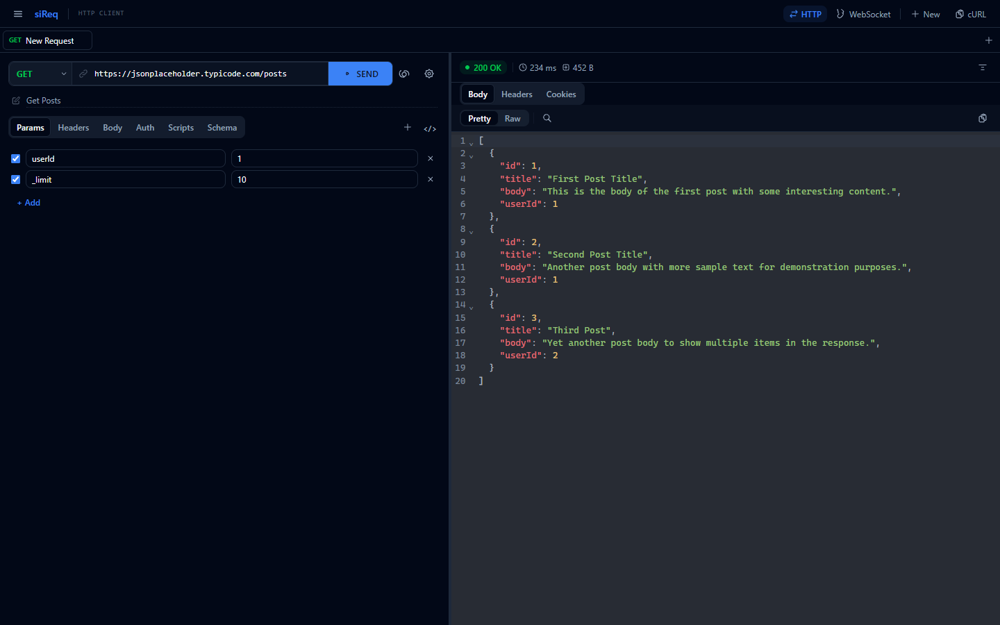
</p>

### Collections & Environments

<p align="center">
  
</p>

### Scripts & Variables

<p align="center">
  
</p>

### Import Tools

<p align="center">
  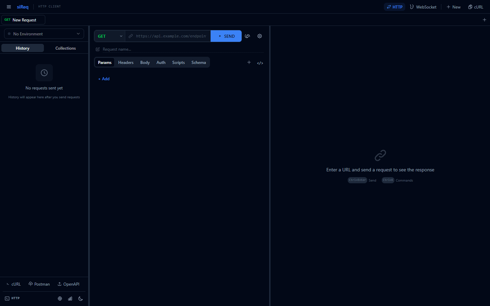
</p>

### gRPC Panel

<p align="center">
  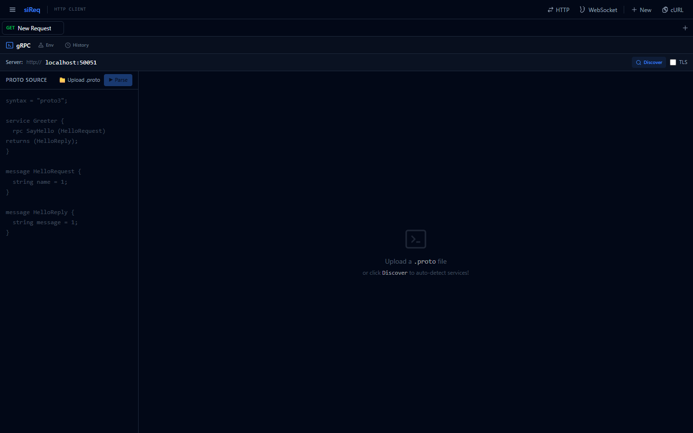
</p>

### WebSocket Client

<p align="center">
  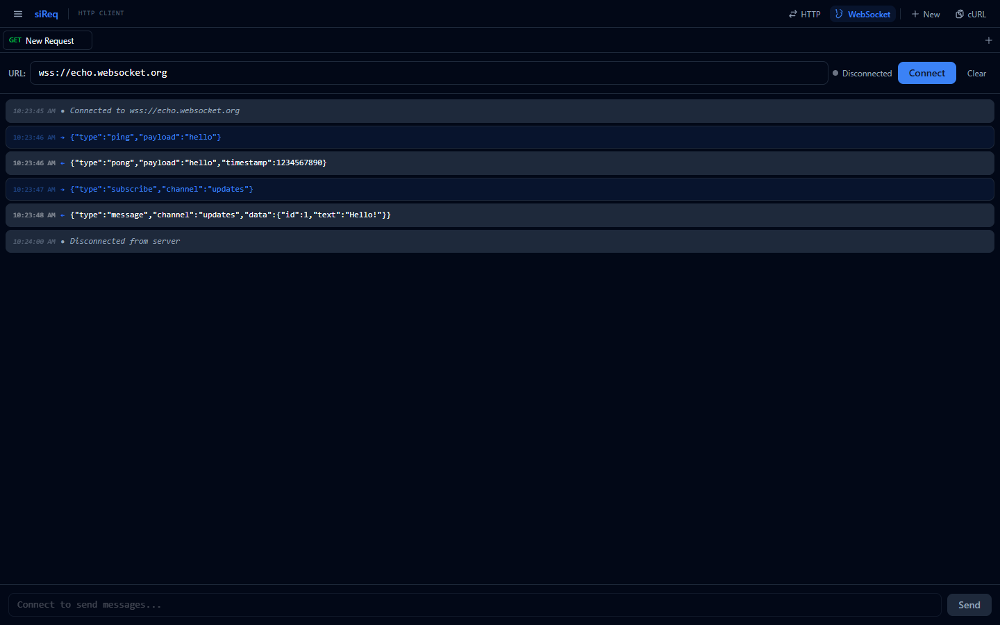
</p>

### Benchmark Results

<p align="center">
  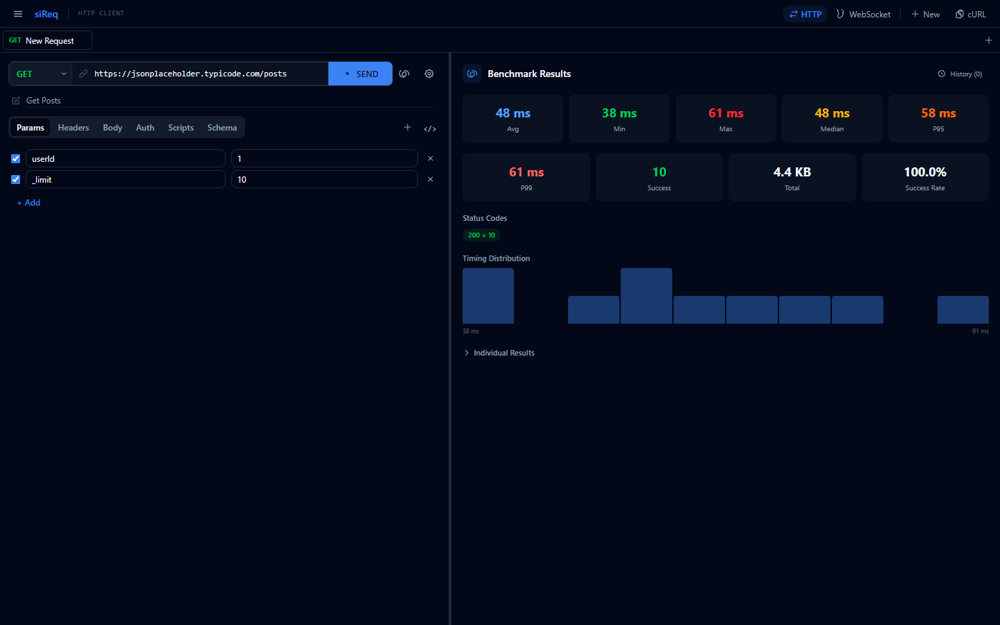
</p>

### Collection Runner

<p align="center">
  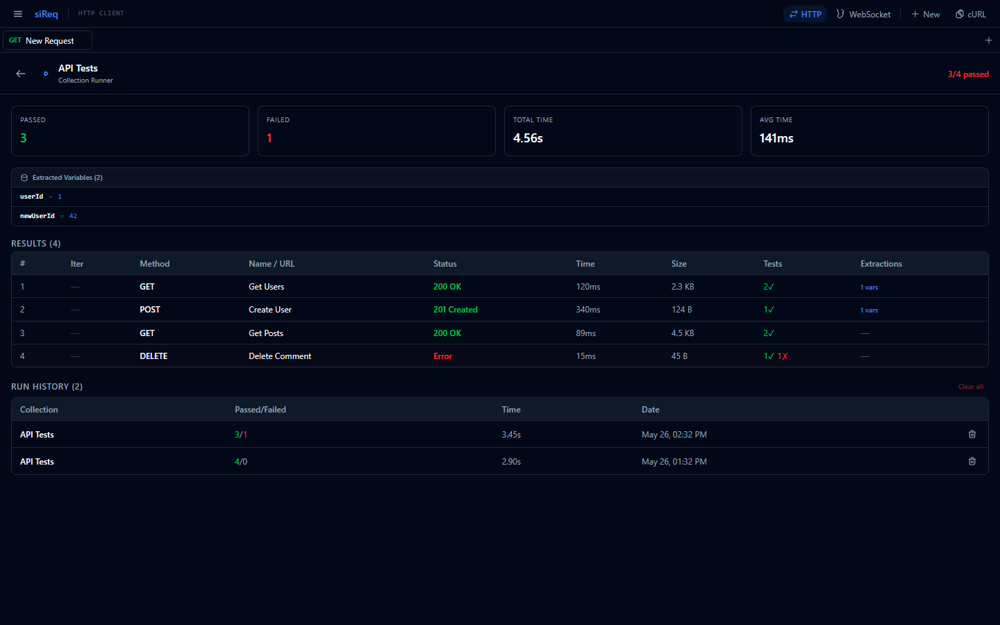
</p>

### API Intelligence

<p align="center">
  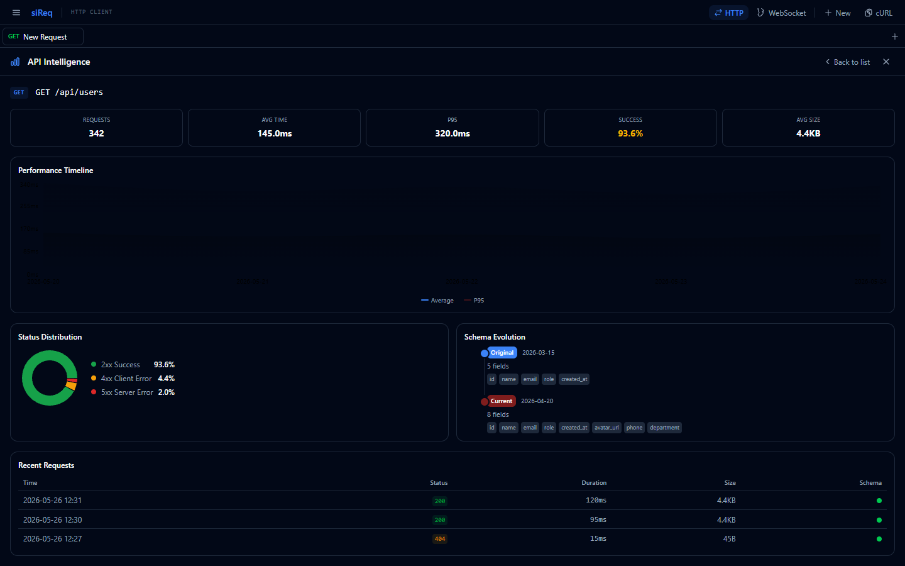
</p>

### Themes & Settings

<p align="center">
  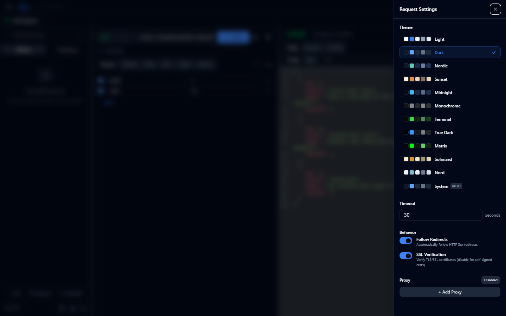
</p>

---

## Installation

### Prerequisites

- **Node.js** 18+ (recommended: 20+)
- **Rust** stable toolchain (install via [rustup](https://rustup.rs/))
- **Tauri v2 system prerequisites** — See the [official Tauri guide](https://v2.tauri.app/start/prerequisites/) for your platform

### Clone & Install

```bash
git clone <repository-url>
cd siReq
npm install
```

### Run in Development

```bash
npx tauri dev
```

This launches the desktop application with hot-reload for both the Rust backend and the React frontend.

### Frontend-Only Development

```bash
npm run dev
```

Starts only the Vite dev server. Note that Tauri commands (`invoke`) will not be available — use this for UI-only work.

### Build for Production

```bash
npm run build        # Build the frontend
npx tauri build      # Build the desktop app installer
```

---

## Quick Start

1. **Launch the app** — Run `npx tauri dev`
2. **Select or create an environment** — Click the environment dropdown in the sidebar
3. **Enter a URL** — Type `https://jsonplaceholder.typicode.com/posts/1` in the URL bar
4. **Select a method** — Default is GET
5. **Send the request** — Click **Send** or press <kbd>Ctrl+Enter</kbd>
6. **Inspect the response** — View the formatted JSON body, headers, cookies, and stats
7. **Save to collection** — Click the **Collections** tab in the sidebar and create/save your request
8. **Organize** — Create folders, add more requests, and run them all with the Collection Runner

---

## Detailed Features

### HTTP Requests

siReq supports the full HTTP method set: **GET**, **POST**, **PUT**, **PATCH**, **DELETE**, **HEAD**, **OPTIONS**, and **TRACE**.

**Request building includes:**

- **URL Bar** — Integrated method selector + URL input + send button in one compact bar
- **Query Parameters** — Key-value editor with enable/disable toggles
- **Headers** — Key-value editor with enable/disable, common headers auto-suggested
- **Body** — Supports multiple content types:
  - **None** — No body (GET, HEAD, etc.)
  - **JSON** — Syntax-highlighted editor with formatting
  - **XML** — Syntax-highlighted editor
  - **Text** — Plain text input
  - **Form Data** — Multipart form with file upload support
  - **Form URL-encoded** — URL-encoded key-value pairs
- **Auth** — Built-in authentication:
  - **Basic Auth** — Username and password
  - **Bearer Token** — Token-based authorization
  - **API Key** — Pass as header or query parameter
- **Settings** — Timeout (1–600s), follow redirects, SSL verification toggle, proxy configuration (URL + optional authentication)
- **Cancel** — Cancel an in-flight request at any time
- **Copy as cURL** — Generate a cURL command from the current request
- **Request Name** — Optional label for saved requests

### Response Viewer

After sending a request, the response panel displays:

- **Status Bar** — Color-coded status code and status text, response time (ms), response size
- **Body** — Multiple viewing modes:
  - **Pretty** — Formatted with syntax highlighting (JSON, XML, HTML, JavaScript, CSS auto-detected)
  - **Raw** — Unformatted plain text
  - **Preview** — Image rendering and PDF viewer for binary responses
  - **Find-in-page** — Search within the response body
  - **Virtualized rendering** — For large responses (100k+ characters)
- **Headers** — Table of response headers with key-value pairs
- **Cookies** — Parsed cookies from `Set-Cookie` headers
- **Diff** — Compare current response with the previous response (line-by-line diff)
- **Schema** — JSON schema viewer for API responses
- **Copy** — Copy response body to clipboard
- **Save** — Download binary responses (images, PDFs)

### Collections

Organize your API requests into collections:

- **Tree structure** — Nested folders and requests
- **Create, edit, delete** — Full CRUD for collections, folders, and requests
- **Move items** — Reorganize by moving items between folders
- **Collection-level auth & variables** — Shared across all collection items
- **Postman-compatible** — Import and export Postman collections

### Environments & Variables

Manage configuration across different contexts:

- **Environments** — Create separate environments (e.g., development, staging, production)
- **Variables** — Key-value pairs with enable/disable toggle
- **Global variables** — Shared across all environments
- **Variable resolution** — Use `{{variableName}}` syntax in URLs, headers, body, and auth fields
- **Dynamic variables** — Built-in helpers:
  - `{{$timestamp}}` — Current Unix timestamp
  - `{{$uuid}}` — Random UUID v4
  - `{{$randomInt}}` — Random integer (0–1000)
  - `{{$randomInt N,M}}` — Random integer in range [N, M]
  - `{{$randomString}}` — Random 8-character alphanumeric string
  - `{{$randomString N}}` — Random N-character alphanumeric string
  - `{{$randomEmail}}` — Random email address
  - `{{$guid}}` — Random UUID v4 (alias for `$uuid`)
  - `{{$timestamp ms}}` — Current Unix timestamp in milliseconds
- **Secret storage** — Variables can be marked as secrets and encrypted at rest (AES-256-GCM)
- **Script-modified variables** — Pre-request scripts can set variables that flow into the request and post-response scripts

### Scripting & Automation

siReq embeds a **QuickJS** JavaScript engine for request and response scripting:

- **Pre-request scripts** — Execute JavaScript before sending the request to:
  - Modify request headers, body, URL, or auth
  - Set environment variables dynamically
  - Log debugging information
- **Post-response scripts** — Execute JavaScript after receiving the response to:
  - Write test assertions with pass/fail results
  - Extract values from the response body
  - Set variables for subsequent requests
- **Script API** — Familiar Postman-like interface:
  - `pm.request` — Access and modify the outgoing request
  - `pm.response` — Access the received response
  - `pm.variables` — Get and set variables
  - `pm.test()` — Define test cases
  - `console.log()` — Output debugging logs
- **Variable extraction** — Configure JSONPath expressions to automatically extract values from responses into variables

### Import / Export

Seamlessly move data between tools:

- **cURL Import** — Paste a cURL command and siReq parses it into a fully populated request (method, URL, headers, body, auth)
- **OpenAPI / Swagger Import** — Import an OpenAPI specification (JSON or YAML) and generate a full collection with endpoints, parameters, and request schemas
- **Postman Import** — Import Postman collections (v2.1) with requests, folders, auth, and variables
- **Postman Export** — Export your siReq collections back to Postman format

### GraphQL Client

Full-featured GraphQL client for querying, mutating, and subscribing:

- **Schema Explorer** — Interactive schema navigator showing `Query`, `Mutation`, and `Subscription` entrypoints, arguments, nested field types, and descriptions.
- **Introspection & SDL** — Run schema introspection queries against your endpoint or paste a raw SDL schema string directly.
- **GraphQL Editor** — Fully featured query editor with syntax highlighting, autocomplete, and real-time schema linting (powered by CodeMirror 6).
- **Variables Editor** — Dedicated JSON variables editor with on-the-fly syntax validation.
- **Header & Auth Sections** — Configure custom HTTP headers, Bearer tokens, Basic auth, or API Keys.
- **Subscriptions** — Dynamic connection to subscription endpoints using WebSocket (`graphql-ws` protocol) with real-time log, message counters, and status indicators.
- **Collection Integration** — Fully integrated with siReq's collection list, folders, environments, and toast alerts. Auto-detects GQL queries in collections and tags them with a visual `GQL` badge.

### gRPC Client

Full gRPC support with siReq's dedicated gRPC panel:

- **Proto file parsing** — Upload and parse `.proto` files (proto2 and proto3 syntax)
- **Service reflection** — Use gRPC reflection to auto-discover services from a running gRPC server
- **Method selection** — Browse services and methods in an interactive tree
- **Input builder** — Dynamically generated form based on protobuf message fields (supports nested messages, repeated fields, maps, enums)
- **Call types** — Full support for all four gRPC streaming types:
  - **Unary** — Single request, single response
  - **Server-streaming** — Single request, stream of responses
  - **Client-streaming** — Stream of requests, single response
  - **Bidirectional streaming** — Stream of requests, stream of responses
- **TLS support** — Toggle TLS for secure connections
- **Environment variables** — Variable resolution in gRPC inputs
- **Response viewer** — JSON-formatted response with status, headers, timing, and size
- **gRPC history** — Full history of gRPC calls with search and restore

### WebSocket Client

Real-time communication testing:

- **Connect** — Connect to `ws://` and `wss://` endpoints
- **Status indicator** — Visual connection state (disconnected, connecting, connected)
- **Send messages** — Send text messages over the active connection
- **Message log** — Real-time log with timestamps, direction indicators (sent →, received ←, system ●)
- **Color-coded messages** — Sent (primary), received (accent), system (muted)
- **Clear log** — Reset the message history
- **Environment variables** — Variable resolution in WebSocket URL and sent messages
- **Tauri events** — Uses Tauri event system for real-time WebSocket communication

### Smart Mock Server

siReq integrates a local-first **Smart Mock Server** that lets you simulate mock API endpoints directly on your local machine using an Axum-powered HTTP server in Rust:

- **Automatic Mocking** — Instantly import an OpenAPI JSON/YAML specification or an existing siReq collection, and automatically generate endpoints, methods, and default response payloads
- **Lifecycle Control** — Spin servers up/down instantly with custom TCP ports (up to 5 concurrent running servers) with direct socket bind error reporting
- **Rule-Based Routing** — Create advanced condition groups. Incoming HTTP requests are matched against custom header, query param, body, or JSONPath filters, and routed to the corresponding response scenario
- **Dynamic Faker Engine** — Response templates support placeholder resolution to inject synthetic data:
  - `{{faker.uuid}}` / `{{faker.name}}` / `{{faker.email}}` / `{{faker.date}}` / `{{faker.integer(min,max)}}`
  - Dynamic request variables: `{{request.path}}`, `{{request.query.param}}`, `{{request.headers.header}}`, and `{{request.body.jsonPath}}` to mirror request data back in the response
- **Latency Emulation** — Add latency profiles to endpoints: fixed latency (e.g. `300ms`), random delay ranges (`100ms - 500ms`), or normal distribution delays (`mean: 300ms, std_dev: 50ms`) to stress-test your application
- **CORS Configurator** — Set custom CORS settings per-server, enabling seamless cross-origin request testing for local frontend dev scripts
- **Live Logs Console** — Inspect logs in real time. Filter logs by search queries, click any item to see full request/response payloads, and track aggregate counts and latencies directly in the side console

### Benchmark Tool

Performance testing for your APIs:

- **Configurable iterations** — Run 1 to 1000 requests
- **Comprehensive statistics**:
  - **Min** / **Max** / **Avg** latency
  - **Median** / **P95** / **P99** percentile latencies
  - **Success count** / **Failure count**
  - **Total bytes transferred**
  - **Success rate percentage**
- **Visual distribution** — Bar chart showing timing distribution
- **Status code analysis** — Grouped and counted status codes
- **Individual results** — Per-request timing and status table
- **History** — Full benchmark history with the ability to restore and re-examine past results
- **Compare** — Side-by-side comparison of two benchmark runs

### Collection Runner

Automate API testing with collection runs:

- **Sequential execution** — Run all requests in a collection in order
- **Configurable delay** — Add delay between requests (0ms, 100ms, 200ms, 500ms, 1s, 2s, 5s)
- **Stop on failure** — Halt execution on the first failed request
- **Data-driven runs** — Import datasets from CSV or JSON files to run the collection multiple times with different data
  - Each row in the dataset becomes a variable scope for one execution pass
  - Preview the dataset before running
- **Results table** — Detailed per-request results showing:
  - Method, name/URL, status code, response time, size
  - Test pass/fail counts
  - Extracted variables
  - Error details
- **Summary cards** — Passed, failed, total time, average time
- **Extracted variables view** — All variables extracted during the run
- **Run history** — Full history of all collection runs with dates, pass/fail stats, and delete/clear

### Visual Chaining Flow Editor

siReq provides a state-of-the-art, GPU-accelerated **Visual Chaining Flow Editor** (Node-Graph style) to visually model, link, and automate sequential request workflows:

<p align="center">
  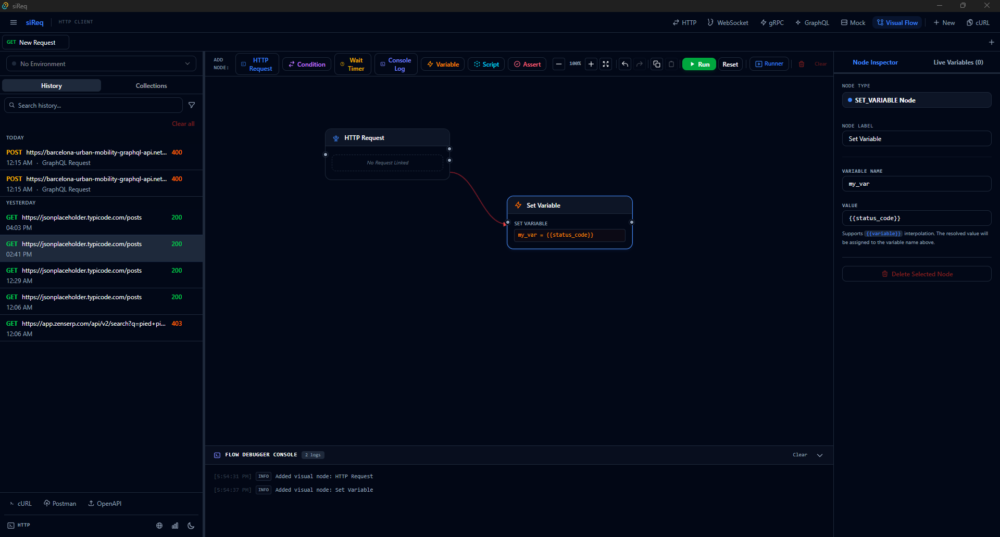
</p>

**Interactive Canvas & Editor features:**
- **Grid Backdrop** — Interactive vector dot-grid supporting drag-to-pan, pinch-to-zoom, and mouse scroll wheel zoom. Nodes snap to 10px coordinates for clean layouts.
- **Cubic Bezier Wires** — Fluid connection paths linking inputs and outputs. During execution, wires trigger **neon travelers** (pulsing glowing sparks) that run along the path to illuminate downstream routes in real time!
- **Execution Debugger** — Run the entire flow visually. Nodes light up in **pulsing Cyan** when running, **Green** on success, or **Red** on failure.
- **Flow Debugger Terminal** — A collapsible monospaced stream panel at the bottom of the canvas displaying chronological execution steps, millisecond response speeds, data warnings, and logger outputs in real-time.
- **Live Variables Monitor** — Lists all evaluated variable states in the active flow context, displaying their drop-in `{{placeholders}}` format.

**Visual Node Types:**
- **Start Node** — Simple green glowing trigger pill starting the execution.
- **HTTP Request Node** — Binds to any saved request or open tab in the workspace (displays method badges like `GET` or `POST`, URL, and statistics). Supports **Response Extractions**: configure JSONPath expressions (e.g. `$.token` -> `flow_token`) to automatically extract JSON values from responses into the variables stream.
- **Wait Timer Node** — Pauses execution flow dynamically for a specified delay in milliseconds.
- **Branch Condition Node** — Evaluates standard JavaScript conditions (e.g. `status_code === '200'`) against current variable values, branching into `True` or `False` trigger paths.
- **Console Log Node** — Formats and prints custom strings (e.g. `Received user ID: {{user_id}}`) directly to the debugger terminal.

---

### API Intelligence

Analyze your API behavior over time:

- **Overview dashboard** — Aggregate statistics about your API usage
- **Endpoint insights** — Per-endpoint analysis with performance metrics
- **Endpoint detail view** — Deep dive into individual endpoints
- **Performance charts** — Latency trends over time
- **Status distribution** — Status code breakdown with charts
- **Schema evolution** — Track how API response schemas change over time
- **Performance regressions** — Automatic detection of performance degradation
- **History-driven** — All analysis is based on actual request history

### UI / UX

Designed for productivity:

- **12 themes** — Dark, Light, Nordic, Sunset, Midnight, Monochrome, Terminal, True Dark, Matrix, Solarized, Nord, and System (follows OS preference)
- **Resizable panels** — Drag-to-resize request/response panels and sidebar
- **Tab-based workflow** — Multiple requests open simultaneously in tabs
- **Keyboard shortcuts**:
  - <kbd>Ctrl+Enter</kbd> — Send request
  - <kbd>Ctrl+L</kbd> — Focus URL bar
  - <kbd>Ctrl+N</kbd> — New request
  - <kbd>Ctrl+T</kbd> — New tab
  - <kbd>Ctrl+W</kbd> — Close current tab
  - <kbd>Ctrl+Tab</kbd> / <kbd>Ctrl+Shift+Tab</kbd> — Switch tabs
  - <kbd>Ctrl+B</kbd> — Toggle sidebar
  - <kbd>Ctrl+K</kbd> — Command palette
  - <kbd>?</kbd> — Keyboard shortcuts dialog
  - <kbd>Ctrl+Alt+H</kbd> — HTTP mode
  - <kbd>Ctrl+Alt+W</kbd> — WebSocket mode

- **Command palette** (<kbd>Ctrl+K</kbd>) — Quick access to all major actions
- **Toast notifications** — Non-intrusive feedback for actions
- **Responsive layout** — Adaptive design for different window sizes

---

## Tech Stack

### Frontend

| Technology | Purpose |
|-----------|---------|
| **React 19** | UI framework |
| **TypeScript** | Type-safe JavaScript |
| **Vite 8** | Build tool and dev server |
| **Tailwind CSS v4** | Utility-first styling |
| **Zustand** | State management with persistence |
| **Radix UI** | Accessible UI primitives (dialog, select, tabs, tooltip, etc.) |
| **CodeMirror 6** | Code editor, GraphQL autocomplete/linting, JSON validation |
| **graphql** | AST parsing and GraphQL schema validation |
| **graphql-ws** | WebSocket client for GraphQL subscriptions |
| **Recharts** | Charts and data visualization |
| **react-resizable-panels** | Resizable split pane layout |
| **react-virtuoso** | Virtualized list rendering for large responses |
| **lucide-react** | Icon library |
| **diff** | Text diff algorithm |

### Backend

| Technology | Purpose |
|-----------|---------|
| **Tauri v2** | Desktop application framework |
| **Rust** | Systems programming language |
| **reqwest** | HTTP client with HTTP/2, cookies, multipart, streaming |
| **tokio** | Async runtime |
| **rusqlite** | SQLite database bindings |
| **tonic** | gRPC client with TLS |
| **prost / prost-reflect** | Protocol Buffers serialization |
| **protox** | Protobuf file parser |
| **tokio-tungstenite** | WebSocket client |
| **axum** | High-performance catch-all HTTP server for mock routing |
| **rand_distr** | Normal distribution generation for latency emulation |
| **jsonpath-rust** | JSONPath request matching and faker resolution |
| **rquickjs** | JavaScript scripting engine (QuickJS) |
| **aes-gcm** | AES-256-GCM encryption for secrets |

### Storage & Security

| Technology | Purpose |
|-----------|---------|
| **SQLite** | Persistent storage for all data |
| **AES-256-GCM** | Encrypted secret variable storage |
| **SHA-256** | Key derivation for encryption |

---

## Data Persistence & Security

siReq stores all data **locally** in a SQLite database located in the application's data directory. No data leaves your machine unless you send a request.

**Stored data includes:**
- Request history
- Collections, folders, and saved requests
- Environments and their variables
- Global variables
- Cookies from responses
- Benchmark history
- Collection run history
- gRPC request history
- Request templates
- UI state (theme, sidebar, active tab, etc.)

**Security features:**
- Secret variables are encrypted at rest using **AES-256-GCM**
- Encryption keys are derived using SHA-256
- No telemetry, no analytics, no cloud sync
- All network requests originate from your machine to the target servers

---

## Project Structure

```
siReq/
├── src/                    # React frontend
│   ├── App.tsx             # Root component
│   ├── main.tsx            # Entry point
│   ├── components/         # UI components
│   │   ├── Request/        # Request builder (URL, headers, body, auth, scripts, schema)
│   │   ├── Response/       # Response viewer (body, headers, cookies, diff, schema)
│   │   ├── Sidebar/        # Sidebar (history, collections, environment)
│   │   ├── Intelligence/   # API Intelligence dashboard
│   │   ├── GrpcPanel.tsx / Grpc*.tsx  # gRPC client
│   │   ├── WebSocketPanel.tsx         # WebSocket client
│   │   ├── Flow/                      # Visual Chaining Flow Editor
│   │   │   ├── FlowPanel.tsx          # Main shell, toolbar, sidebar inspectors, & flow terminal
│   │   │   ├── FlowCanvas.tsx         # SVG/HTML grid canvas, pan/zoom, snapping, & wires drawer
│   │   │   └── FlowNode.tsx           # Visual render cards for Start, Request, Condition, Timer, & Logger
│   │   ├── MockServer/                # Smart Mock Server components
│   │   │   ├── MockPanel.tsx          # 3-column mock server dashboard orchestrator
│   │   │   ├── MockConfigList.tsx     # Server instances listing, start/stop, duplicate, delete
│   │   │   ├── MockEndpointEditor.tsx # Endpoint path, method selector, and CORS settings
│   │   │   ├── MockScenarioEditor.tsx # Conditional response scenario details
│   │   │   ├── MockMatcherEditor.tsx  # Matching rules (headers, query, JSONPath)
│   │   │   ├── MockLatencyEditor.tsx  # Latency profiles configurator
│   │   │   ├── MockCorsEditor.tsx     # CORS headers controller
│   │   │   ├── MockLogViewer.tsx      # Real-time console logs and metrics dashboards
│   │   │   ├── MockLogDetail.tsx      # Log inspection details popup
│   │   │   ├── MockStatusBadge.tsx    # Glow status online/offline visual indicators
│   │   │   └── MockImportDialog.tsx   # OpenAPI JSON/YAML & collection mapper dialog
│   │   ├── RunnerPanel.tsx            # Collection runner
│   │   ├── ThemeProvider.tsx / ThemeToggle.tsx  # Theme system
│   │   └── ...                        # Other components
│   ├── stores/             # Zustand state stores
│   │   ├── mockStore.ts    # Smart Mock Server Zustand state store
│   │   ├── flowStore.ts    # Visual Flow Editor Zustand state store
│   │   └── ...
│   ├── lib/                # Utilities and Tauri invoke wrappers
│   ├── hooks/              # Custom React hooks
│   └── styles/             # Global CSS (Tailwind)
├── src-tauri/              # Rust backend
├── src-tauri/              # Rust backend
│   ├── src/
│   │   ├── main.rs         # Desktop entry point
│   │   ├── lib.rs          # Tauri app setup (commands, plugins, state)
│   │   ├── commands/       # Tauri commands (HTTP, collections, env, mock server, etc.)
│   │   │   ├── mock_server.rs # Smart Mock Server commands
│   │   │   └── ...
│   │   ├── mock_server/    # Smart Mock Server module
│   │   │   ├── mod.rs      # Submodule exports
│   │   │   ├── models.rs   # Config, Scenarios, Rules, Log, and Stats structs
│   │   │   ├── storage.rs  # SQLite CRUD database functions
│   │   │   ├── latency.rs  # fixed, range, and normal distribution delay simulators
│   │   │   ├── faker.rs    # faker snippet resolvers & request variables echo mapping
│   │   │   ├── openapi.rs  # OpenAPI to mock server converter logic
│   │   │   ├── collection_import.rs # Existing Collection to mock server mapper
│   │   │   ├── router.rs   # axum catch-all route engine with preflights & matchers
│   │   │   └── manager.rs  # thread managers, concurrent limiters, and socket builders
│   │   ├── http.rs         # HTTP request execution
│   │   ├── grpc.rs         # gRPC client
│   │   ├── websocket.rs    # WebSocket client
│   │   ├── curl_parser.rs  # cURL command parser
│   │   ├── openapi_parser.rs  # OpenAPI spec parser
│   │   ├── postman_parser.rs  # Postman collection import/export
│   │   ├── scripts.rs      # JavaScript scripting engine
│   │   ├── variables.rs    # Variable resolution engine
│   │   ├── storage.rs      # SQLite database layer
│   │   ├── models.rs       # Shared data models
│   │   ├── secrets.rs      # AES-256-GCM encryption
│   │   └── api_intelligence.rs  # API analytics engine
│   └── Cargo.toml          # Rust dependencies
├── docs/
│   └── screenshots/        # README screenshots
└── package.json            # Frontend dependencies
```

## Contributing

Contributions are welcome! Here's how you can help:

- **Report bugs** — Open an issue with detailed reproduction steps
- **Suggest features** — Open an issue with your idea
- **Submit pull requests** — Fork the repo, make changes, and submit a PR

**Development setup:**

```bash
git clone <repository-url>
cd siReq
npm install
npx tauri dev
```

---

## License

This project is currently not licensed. All rights reserved.

---

<p align="center">
  <strong>Built with ❤️ using Tauri v2 · Rust · React · TypeScript</strong>
</p>
